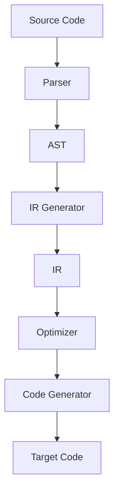
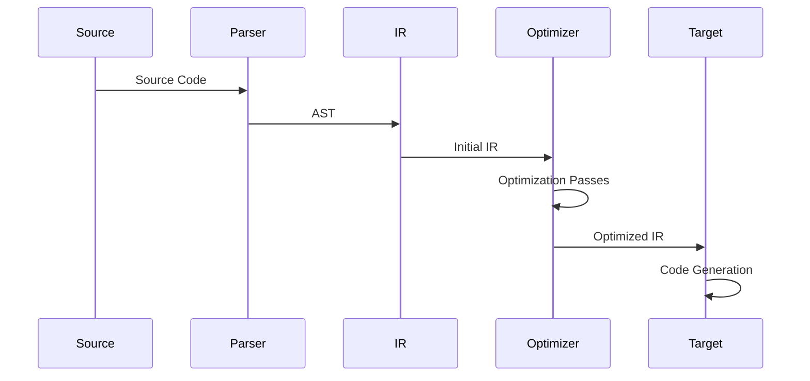
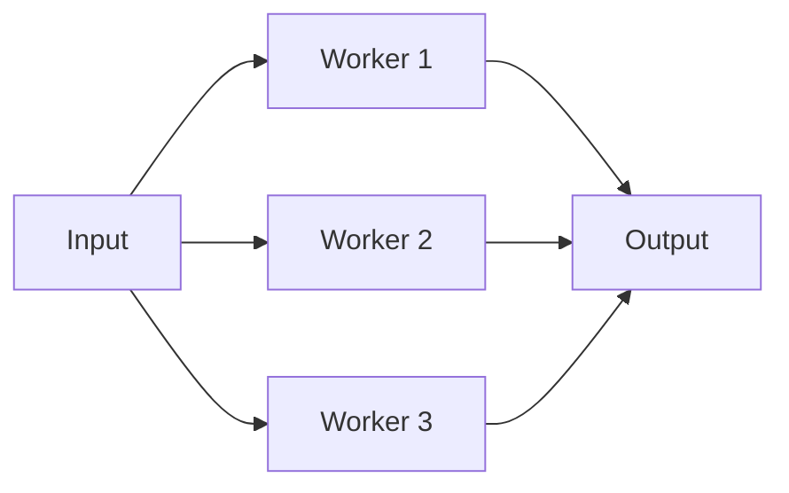

# Apollo Architecture

This document explains Apollo's architecture and the reasoning behind its design decisions. Understanding these concepts will help you work more effectively with Apollo and contribute to its development.

## Core Philosophy

Apollo is built on three key principles:

1. **Extensibility**: Every component is designed to be extended or replaced
2. **Composability**: Features can be combined in powerful ways
3. **Performance**: Optimizations are built into the core design

## System Overview



### Component Roles

1. **Parser**
   - Converts source text to AST
   - Handles syntax extensions
   - Manages source locations

2. **IR Generator**
   - Converts AST to IR
   - Performs initial analysis
   - Handles macro expansion

3. **Optimizer**
   - Performs IR transformations
   - Implements optimization passes
   - Maintains semantics

4. **Code Generator**
   - Produces target code
   - Handles platform specifics
   - Manages runtime integration

## Design Decisions

### Why Racket?

Apollo is built on Racket for several reasons:

1. **Macro System**
   - Powerful syntax transformation
   - Hygiene guarantees
   - Phase separation

2. **Module System**
   - First-class modules
   - Fine-grained control
   - Cross-phase persistence

3. **Ecosystem**
   - Rich standard library
   - Package management
   - Development tools

### IR Design

> info: IR Philosophy
> The IR system is designed to be:
> - Simple enough to understand
> - Powerful enough to optimize
> - Flexible enough to extend

Key IR design decisions:

1. **Explicit Phases**
   ```racket
   (module phase racket/base
     (define-syntax (phase stx)
       (syntax-parse stx
         [(_ name:id)
          #'(begin
              (provide name)
              (define name
                (make-phase-level)))])))
   ```

2. **Pattern Matching**
   ```racket
   (define-match-expander ir-lambda
     (syntax-parser
       [(_ formals body ...)
        #'(ir-lambda-core formals '() body ...)]
       [(_ formals kw-formals body ...)
        #'(ir-lambda-core formals kw-formals body ...)]))
   ```

3. **Optimization Framework**
   ```racket
   (define-optimizer constant-folding
     #:phase optimize
     #:priority 100
     (pattern [(app op:primitive args:literal ...)
              #:when (constant-foldable? #'op)
              #:with result (eval-constant #'op #'args)
              result]))
   ```

## Component Interactions

### Compilation Pipeline



### Extension Points

Apollo provides several extension points:

1. **Syntax Extensions**
   ```racket
   (define-syntax-extension point
     #:phase compile
     #:hook syntax-transform
     (lambda (stx)
       (syntax-parse stx
         [(_ expr)
          #'(transform expr)])))
   ```

2. **IR Transformations**
   ```racket
   (define-ir-pass my-transform
     #:phase optimize
     #:dependencies [constant-folding]
     (lambda (ir)
       (ir-transform ir)))
   ```

3. **Code Generation**
   ```racket
   (define-backend my-target
     #:name "My Target"
     #:file-extension ".mytarget"
     #:generator my-code-generator)
   ```

## Performance Considerations

### Memory Management

Apollo uses several strategies for memory efficiency:

1. **Immutable Data Structures**
   - Persistent hash tables
   - Immutable vectors
   - Shared substructures

2. **Caching**
   - Syntax object caching
   - IR node caching
   - Path resolution caching

3. **Lazy Evaluation**
   - On-demand expansion
   - Lazy optimization passes
   - Incremental compilation

### Parallelization



## Future Directions

1. **Cross-Platform Support**
   - WebAssembly backend
   - Native code generation
   - Multiple runtime targets

2. **Enhanced Tooling**
   - Language server protocol
   - Debugging support
   - Profile-guided optimization

3. **Ecosystem Growth**
   - Package management
   - Community extensions
   - Standard library expansion

## See Also

- [IR System Design](ir-system.md)
- [Compilation Process](compilation.md)
- [Performance](performance.md) 