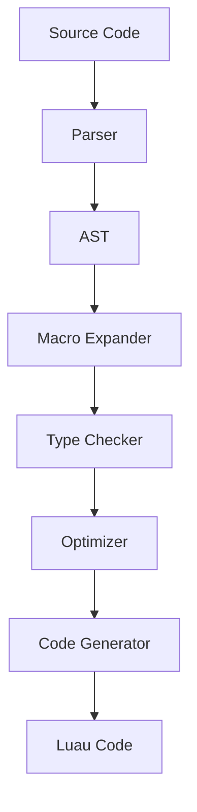

# Architecture Overview

This document explains the architecture of the Apollo compiler.

## System Components

## Component Details

### 1. Parser

The parser converts Racket source code into an abstract syntax tree (AST).

**Key Features:**
- Handles Racket syntax
- Preserves source locations
- Supports language extensions

### 2. Macro Expander

Expands macros before type checking.

**Key Features:**
- Supports Racket's macro system
- Handles hygiene
- Preserves source locations

### 3. Type Checker

Performs type inference and checking.

**Key Features:**
- Gradual typing
- Type inference
- Runtime type checks
- Error reporting

### 4. Optimizer

Applies optimizations to the AST.

**Key Features:**
- Constant folding
- Dead code elimination
- Inline expansion
- Type-specific optimizations

### 5. Code Generator

Generates Luau code from the optimized AST.

**Key Features:**
- Target-specific code generation
- Source map generation
- Error handling
- Performance optimizations

## Data Flow

1.  **Source Code → AST**
    - Parsing
    - Syntax validation
    - Source location tracking

2.  **AST → Expanded AST**
    - Macro expansion
    - Syntax transformation
    - Hygiene maintenance

3.  **Expanded AST → Typed AST**
    - Type inference
    - Type checking
    - Error reporting

4.  **Typed AST → Optimized AST**
    - Optimization passes
    - Transformation
    - Analysis

5.  **Optimized AST → Luau Code**
    - Code generation
    - Source maps
    - Error handling

## Design Decisions

### 1. Type System

**Decision:** Implement gradual typing
**Rationale:**
- Compatibility with Racket
- Flexibility for users
- Safety when needed

### 2. Optimization Strategy

**Decision:** Multi-pass optimization
**Rationale:**
- Better optimization opportunities
- Clear separation of concerns
- Maintainable code

### 3. Error Handling

**Decision:** Comprehensive error reporting
**Rationale:**
- Better developer experience
- Easier debugging
- Clear error messages

## Limitations

1.  **Performance**
    - Some Racket features may impact performance
    - Optimization trade-offs
    - Runtime overhead

2.  **Compatibility**
    - Not all Racket features supported
    - Some Luau features not accessible
    - Platform differences

3.  **Debugging**
    - Source maps limitations
    - Runtime error handling
    - Performance profiling

## Future Directions

1.  **Enhanced Type System**
    - More type features
    - Better inference
    - Runtime checks

2.  **Performance Improvements**
    - Better optimizations
    - Reduced overhead
    - JIT support

3.  **Tooling**
    - Better debugging
    - Profiling support
    - IDE integration

## See Also

*   [Compilation Process](../explanation/compilation.md)
*   [Type System](../explanation/type-system.md)
*   [Configuration Reference](../reference/config.md) 