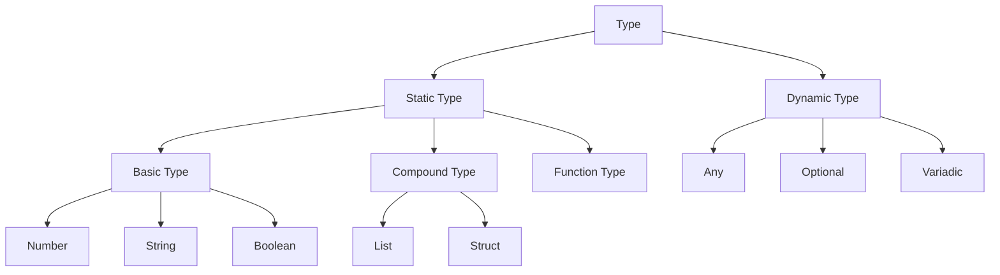

# Type System

This document explains Apollo's type system and how it handles types during compilation.

## Overview

Apollo's type system is based on Racket's type system with some modifications for Luau compatibility:

1.  **Static Types**
    - Basic types (Number, String, Boolean)
    - Compound types (List, Struct)
    - Function types
    - Union types

2.  **Dynamic Types**
    - Any type
    - Optional types
    - Variadic types

3.  **Type Inference**
    - Local type inference
    - Global type inference
    - Type constraints

## Type Hierarchy



## Type Definitions

### Basic Types

```racket
; Number
(define x : Number 42)

; String
(define s : String "hello")

; Boolean
(define b : Boolean #t)
```

### Compound Types

```racket
; List
(define lst : (List Number) '(1 2 3))

; Struct
(struct point ([x : Number] [y : Number]))
(define p : point (point 1 2))
```

### Function Types

```racket
; Simple function
(define (add [x : Number] [y : Number]) : Number
  (+ x y))

; Higher-order function
(define (map [f : (-> Number Number)] [lst : (List Number)]) : (List Number)
  (map f lst))
```

### Union Types

```racket
; Union type
(define (parse-number [s : String]) : (U Number #f)
  (let ([n (string->number s)])
    (if n n #f)))
```

## Type Inference

### Local Inference

```racket
; Types inferred from context
(define (square x)
  (* x x))  ; x inferred as Number

(define (concat s1 s2)
  (string-append s1 s2))  ; s1, s2 inferred as String
```

### Global Inference

```racket
; Types inferred across functions
(define (f x)
  (g x))  ; x's type inferred from g's parameter type

(define (g y)
  (+ y 1))  ; y must be Number
```

### Type Constraints

```racket
; Type constraints
(define (min [x : Number] [y : Number]) : Number
  (if (< x y) x y))

; Type variables
(define (identity [x : A]) : A
  x)
```

## Type Checking

### Static Checking

1.  **Type Rules**
    - Subtyping
    - Type equivalence
    - Type compatibility

2.  **Error Detection**
    - Type mismatches
    - Undefined variables
    - Invalid operations

### Runtime Checking

1.  **Contracts**
    - Function contracts
    - Struct contracts
    - Dynamic checks

2.  **Error Handling**
    - Contract violations
    - Type assertions
    - Error messages

## Type Safety

### Guarantees

1.  **Static Safety**
    - No type errors at runtime
    - Complete type coverage
    - Sound type system

2.  **Runtime Safety**
    - Contract enforcement
    - Null safety
    - Memory safety

### Limitations

1.  **Static Limitations**
    - Undecidable types
    - Complex type inference
    - Performance overhead

2.  **Runtime Limitations**
    - Contract overhead
    - Dynamic features
    - Memory usage

## Best Practices

### Type Annotations

1.  **When to Annotate**
    - Public APIs
    - Complex functions
    - Performance-critical code

2.  **Annotation Style**
    - Be explicit
    - Use meaningful names
    - Document assumptions

### Type Design

1.  **Type Hierarchy**
    - Keep it simple
    - Avoid deep nesting
    - Use appropriate types

2.  **Type Abstractions**
    - Use interfaces
    - Hide implementation
    - Document behavior

## See Also

*   [Compilation Process](../explanation/compilation.md)
*   [Architecture Overview](../explanation/architecture.md)
*   [Configuration Reference](../reference/config.md) 